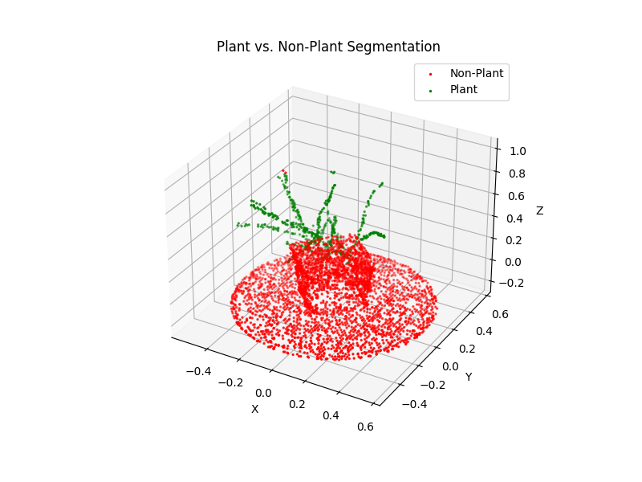

# Point-Cloud-Binary-Segmentation

> **Note**: This project is still a **work in progress**.

A **binary semantic segmentation** pipeline that filters **plant** vs. **non-plant** points in 3D plant point clouds. We treat “plant” as class 1 and “non-plant” as class 0, effectively learning to segment plant structures from soil, background, or other artifacts.

---

## 1. Pipeline Overview

1. **Auto Labeling**  
   - Color-based **ExG** threshold + **DBSCAN** clustering to guess which points are plant vs. non-plant.  

2. **Manual Edits**  
   - Load the resulting color-coded point cloud (`_labeled.ply`) into Meshlab to correct mislabeled points (especially false positives).  
   - Save those edits.

3. **Label Adjustment**  
   - Reconcile the Meshlab changes with the original labeled data, flipping incorrect green points to red (and optionally red to green if needed).

4. **Synthetic Data Generation** (optional)  
   - Generate additional or purely synthetic point clouds (pot, soil, table, scanning artifacts) to **augment** the small real dataset.  
   - Domain randomization for shape/size/noise simulates diverse scanning conditions and helps the model generalize.

5. **Preprocessing**  
   - Downsample (e.g., 4K points) and normalize each cloud for consistent neural network input.

6. **Split**  
   - Divide dataset into train/val/test sets.

7. **Train**  
   - Optionally use **on-the-fly data augmentation** (random rotations, flips, partial dropout) in the dataloader.  
   - Learn a **PointNet++** to classify each point as plant vs. non-plant.  
   - Saves best model upon improved validation IoU.

8. **Evaluate**  
   - Measure accuracy, precision, recall, IoU, etc. on unseen test data.

9. **Inference on New Data**  
   - Load the best model, pass new `.npz` or `.npy` point clouds to get predicted labels.

---

## 2. Core Steps

### Step 1: Batch Process (ExG + Otsu Threshold + DBSCAN)

- **Script**: `src/scripts/batch_threshold_dbscan.py`  
- **Input**: `.ply` files in `data/raw/`.  
- **Output**: `_labeled.ply` and `.npz` files in `data/manually_adjustments/`, with plant=green, non-plant=red.


    ```bash
    python src/main.py --batch_process


### Step 2: Manual Fix in Meshlab
- **Function**:
    - Load any _labeled.ply in Meshlab.
    - Delete or fix incorrectly green-labeled points.
    - Save as <basename>_labeled_plant_only_fixed.ply.

### Step 3: Adjust Labels

- **Script**: src/scripts/adjust_labels.py
- **Function**:
    - Compares Meshlab edits to the original labeled data.
    - Points removed in Meshlab => label=0 (red).
    - (Optional) Also flips mislabeled red=>green if there is _labeled_nonplant_only_fixed.ply.
    
    
    ```bash
    python src/main.py --adjust_labels --config src/configs/default_config.yaml

### Step 4: Preprocess (Downsample + Normalize)
- **Script**: src/data_processing/data_preprocessing.py
- **Function**: 
    - Final labeled .npz from data/manually_adjustments/ 
    - Reduces points to e.g. 4096,
    - Normalizes, saves to data/processed/.


    ```bash
    python src/main.py --preprocess --config src/configs/default_config.yaml

### Step 6: Training

- **Script**: src/training/train.py
- **Function**: 
    - Uses PointNet++ with num_classes=2 for binary segmentation.
    - Trains on the train/val splits
    - Saves best model.
    
    ```bash
    python src/main.py --train --config src/configs/default_config.yaml


### Step 7: Evaluation

- **Script**: src/training/evaluate.py

- **Function**: 
    - Loads the best model, runs on test set,
    - prints metrics (precision, recall, F1, IoU).
    
    ```bash
    python src/main.py --evaluate --config src/config/default_config.yaml

## 3. Configuration

All major parameters (paths, DBSCAN eps, training hyperparams) are in:
    
    ```bash
    src/configs/default_config.yaml

    data:
        raw_dir: "data/raw"
        manual_dir: "data/manually_adjustments"
        processed_dir: "data/processed"
        split_ratios: [0.7, 0.15, 0.15]

    preprocessing:
        voxel_size: 0.02
        num_points: 4096

    training:
        batch_size: 16
        num_epochs: 50
        learning_rate: 0.001
    ...

## 4. Installation & Dependencies

    Python 3.7+ recommended
    PyTorch (for training)
    Other libraries: numpy, open3d, scikit-learn, scipy.
    
    ```bash
    pip install -r requirements.txt

## 5. Intermediate Results

Below are some **non-final** yet promising outcomes demonstrating our model’s steady improvement:

1. **Training Curve**  
   

   *Loss decreases and IoU rises as epochs progress, indicating we’re on track.*

2. **Sample Segmentation**  
   <div align="center">
   
   </div>


3. **Metrics by Checkpoint**  
| Checkpoint | Epoch | Val IoU  | Notes                     |
|-----------|-------|----------|---------------------------|
| v1        | 10    | 0.52     | basic initial training    |
| v2        | 15    | 0.62     | introduced augmentation   |
| v3        | 20    | 0.68     | refined synthetic gen, etc|


## 6. Next Steps / TODO
- **Add More Data**:
    - The dataset is small, limiting IoU to ~70%. More real scans = improved generalization.
- **Refine Training Quality**:
    - Tune on-the-fly augmentation intensities (rotation range, partial dropout fraction).
- **Explore Other Models**  
  - Investigate more advanced architectures beyond PointNet++ (e.g., **RandLA-Net**, **KPConv**, **MinkowskiEngine-based SparseConv**, **Point Transformer**) to push segmentation accuracy further given limited data
- **Better Visualizations**:
    - Add side-by-side “before vs. after segmentation” images showing results.
- **Fine-Tune**:
    - If a domain gap remains, consider domain adaptation or additional partial labeling corrections.