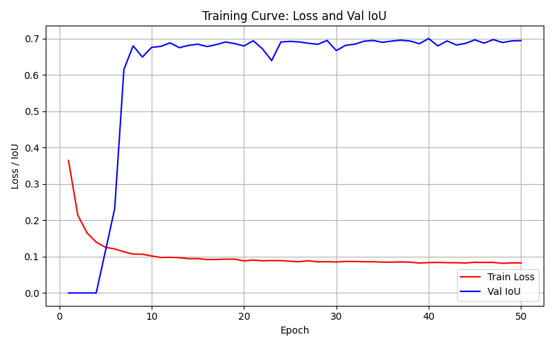
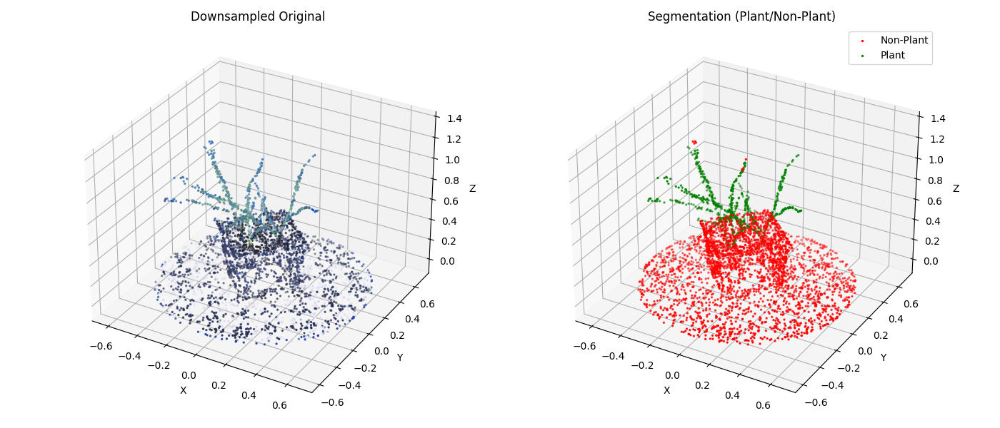

# Point-Cloud-Binary-Segmentation

> **Note**: This project is still a **work in progress**.

A **binary semantic segmentation** pipeline that filters **plant** vs. **non-plant** points in 3D plant point clouds. We treat “plant” as class 1 and “non-plant” as class 0, effectively learning to segment plant structures from soil, background, or other artifacts.

---

## 1. Pipeline Overview

1. **Auto Labeling**  
   - Color-based **ExG** threshold + **DBSCAN** clustering to guess which points are plant vs. non-plant.  

2. **Manual Edits**  
   - Load the resulting color-coded point cloud (`_labeled.ply`) into Meshlab to correct mislabeled points (especially false positives).  
   - Save those edits.

3. **Label Adjustment**  
   - Reconcile the Meshlab changes with the original labeled data, flipping incorrect green points to red (and optionally red to green if needed).

4. **Synthetic Data Generation** (optional)  
   - Generate additional or purely synthetic point clouds (pot, soil, table, scanning artifacts) to **augment** the small real dataset.  
   - Domain randomization for shape/size/noise simulates diverse scanning conditions and helps the model generalize.

5. **Preprocessing**  
   - Downsample (e.g., 4K points) and normalize each cloud for consistent neural network input.

6. **Split**  
   - Divide dataset into train/val/test sets.

7. **Train**  
   - Optionally use **on-the-fly data augmentation** (random rotations, flips, partial dropout) in the dataloader.  
   - Learn a **PointNet++** to classify each point as plant vs. non-plant.  
   - Saves best model upon improved validation IoU.

8. **Evaluate**  
   - Measure accuracy, precision, recall, IoU, etc. on unseen test data.

9. **Inference on New Data**  
   - Load the best model, pass new `.npz` or `.npy` point clouds to get predicted labels.

---


## 2. Configuration

All major parameters (paths, DBSCAN eps, training hyperparams) are in:
    
    ```bash
    src/configs/default_config.yaml

    data:
        raw_dir: "data/raw"
        manual_dir: "data/manually_adjustments"
        processed_dir: "data/processed"
        split_ratios: [0.7, 0.15, 0.15]

    preprocessing:
        voxel_size: 0.02
        num_points: 4096

    training:
        batch_size: 16
        num_epochs: 50
        learning_rate: 0.001
    ...

## 3. Installation & Dependencies

    Python 3.7+ recommended
    PyTorch (for training)
    Other libraries: numpy, open3d, scikit-learn, scipy.
    
    ```bash
    pip install -r requirements.txt

## 4. Intermediate Results

Below are some **non-final** yet promising outcomes demonstrating our model’s steady improvement:

1. **Training Curve**  
   

2. **Sample Segmentation (Side by Side)**  
   


## 5. Test Metrics

A recent run on the real dataset test set yielded:

| Metric        |   Value |
|---------------|--------:|
| **Precision** | 0.7637  |
| **Recall**    | 0.9004  |
| **F1-Score**  | 0.8264  |
| **IoU**       | 0.7042  |

## 5. Next Steps / TODO
- **Add More Data**:
    - The dataset is small, limiting IoU to ~70%. More real scans = improved generalization.
- **Refine Training Quality**:
    - Tune on-the-fly augmentation intensities (rotation range, partial dropout fraction).
- **Explore Other Models**  
  - Investigate more advanced architectures beyond PointNet++ (e.g., **RandLA-Net**, **KPConv**, **MinkowskiEngine-based SparseConv**, **Point Transformer**) to push segmentation accuracy further given limited data
- **Better Visualizations**:
    - Add side-by-side “before vs. after segmentation” images showing results.
- **Fine-Tune**:
    - If a domain gap remains, consider domain adaptation or additional partial labeling corrections.